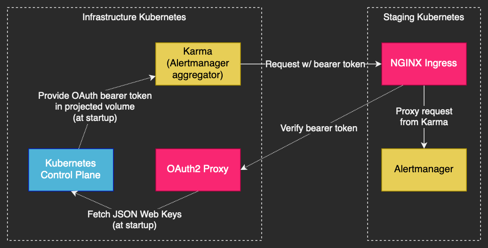
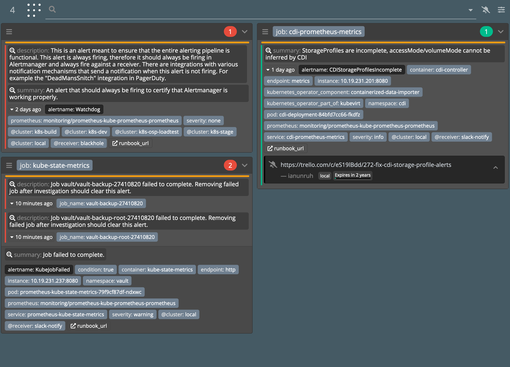

[OAuth2 Proxy](https://oauth2-proxy.github.io/oauth2-proxy/) is a popular tool used to secure access to web applications, which it does by integrating authentication with an [existing OAuth2 identity provider](https://en.wikipedia.org/wiki/List_of_OAuth_providers). I use OAuth2 Proxy in my Kubernetes clusters to secure frontends like Prometheus, Alertmanager, and other internal tools. This allows me to use my personal GitLab instance to act as a central identity provider, reducing the number of passwords needed to be maintained.

Recently, I wanted to allow secure, programmatic access to [Alertmanager](https://prometheus.io/docs/alerting/latest/alertmanager/) between multiple Kubernetes clusters. In each cluster, Alertmanager is deployed using the [kube-prometheus-stack Helm chart](https://github.com/prometheus-community/helm-charts/tree/main/charts/kube-prometheus-stack) and exposed through [NGINX Ingress Controller](https://kubernetes.github.io/ingress-nginx/). This ingress controller [integrates easily](https://kubernetes.github.io/ingress-nginx/examples/auth/oauth-external-auth/) with OAuth2 Proxy. There's a feature in OAuth2 Proxy that allows the identity provider SSO to be skipped, if a bearer token signed by a trusted OpenID issuer is provided by the client. There are many options out there for issuing OpenID tokens, but since I'm already using Kubernetes to run the client application, I wanted to utilize the existing infrastructure it provides for [service accounts](https://kubernetes.io/docs/tasks/configure-pod-container/configure-service-account/).

This post will guide operators on how they can use service account tokens to authenticate with services that are behind OAuth2 Proxy.

## Overview

There are several steps needed for OAuth2 Proxy to be able to trust service account tokens from Kubernetes.

1. Ensure the [Service Account Issuer Discovery](https://kubernetes.io/docs/tasks/configure-pod-container/configure-service-account/#service-account-issuer-discovery) feature is configured properly
2. Configure OAuth2 Proxy to trust the Kubernetes service account issuer
3. Configure the client pod to use a service account token

In my deployment, there is a central "infrastructure" Kubernetes and several environment-specific Kubernetes clusters, such as the staging cluster. Each cluster has a Prometheus stack deployed for monitoring, which includes Alertmanager. [Karma](https://github.com/prymitive/karma) is a tool that aggregates alerts from multiple Alertmanager instances for easy management. It needs to be able to access Alertmanager in each environment-specific cluster, through the NGINX Ingress in that cluster.



OAuth2 Proxy runs on the infrastructure cluster, and all environments use it from their respective NGINX Ingress. OAuth2 Proxy could run on all clusters instead of just the infrastructure cluster, but this architecture works for my particular needs.

## Service Account Issuer Discovery

In Kubernetes v1.18, a feature called [Service Account Issuer Discovery](https://kubernetes.io/docs/tasks/configure-pod-container/configure-service-account/#service-account-issuer-discovery) was added to the API server to expose the service account token issuer using the [standard OIDC discovery mechanism](https://ldapwiki.com/wiki/Openid-configuration). This feature moved to beta stage by Kubernetes v1.20 and GA stage by Kubernetes v1.21. This OIDC discovery mechanism is used by OAuth2 Proxy (along with other OIDC clients) to retrieve the public keys used to verify signed tokens.

My Kubernetes clusters are all deployed using Kubeadm, so there was some extra setup involved to make this mechanism work correctly. If you're using a hosted Kubernetes offering, this will likely work out of the box. Skip to the [Testing the issuer discovery API](#testing-the-issuer-discovery-api) section to verify everything is working.

### Kubeadm

If the service account issuer URL was not configured correctly at cluster bootstrap time, then it needs to be changed to the external URL for the Kubernetes API. However, existing tokens still need to be trusted that were issued with the internal API URL until all old tokens can be rotated. This can be done by passing the `--service-account-issuer` CLI flag multiple times to the API server. However, Kubeadm [does not easily support](https://kubernetes.io/docs/setup/production-environment/tools/kubeadm/control-plane-flags/) passing the same CLI flag multiple times. This use case requires that you use manifest patches instead.

If you are bootstrapping a cluster with Kubeadm for the first time, the 2nd issuer flag is not required, and thus the patch references can be skipped.

The following config snippet should be merged with `/etc/kubeadm.yaml`.

```yaml
---
apiVersion: kubeadm.k8s.io/v1beta3
kind: ClusterConfiguration
apiServer:
  extraArgs:
    service-account-issuer: https://kubernetes.example.com
    service-account-jwks-uri: https://kubernetes.example.com/openid/v1/jwks
---
apiVersion: kubeadm.k8s.io/v1beta3
kind: InitConfiguration
patches:
  directory: /etc/kubeadm/patches
---
apiVersion: kubeadm.k8s.io/v1beta3
kind: JoinConfiguration
patches:
  directory: /etc/kubeadm/patches
```

The following patch file should be created at `/etc/kubeadm/patches/kube-apiserver+json.yaml`.

```yaml
- op: add
  path: /spec/containers/0/command/-
  value: --service-account-issuer=https://kubernetes.default.svc.cluster.local
```

Then apply the changes to each control plane node using the following command.

```bash
kubeadm upgrade apply --config /etc/kubeadm.yaml --patches /etc/kubeadm/patches --force
```

Keep in mind, the `--patches` flag will be required for any subsequent upgrades, otherwise the patch changes could be undone. The `patches` option in `InitConfiguration` and `JoinConfiguration` is ignored during upgrades. In theory, once enough time is passed and all current tokens have expired, the old issuer could be removed. Until then, both issuer URLs are required.

The CLI args for the Kubernetes API server can be verified with the following command.

```bash
kubectl -n kube-system describe po kube-apiserver-controlplane1
```

### Allowing access to the issuer discovery API

The [well-known OpenID endpoints](https://ldapwiki.com/wiki/Openid-configuration) that are provided by the Kubernetes API are not accessible by unauthenticated users out of the box when using Kubeadm. OAuth2 Proxy needs to be able to read from these API endpoints at startup, in order to access the issuer's public key for verifying signed tokens. There is already a cluster role built into Kubernetes that allows access to these endpoints, it just needs to be bound to unauthenticated users.

Create the following resource in the Kubernetes cluster that is issuing the service account tokens.

```yaml
apiVersion: rbac.authorization.k8s.io/v1
kind: ClusterRoleBinding
metadata:
  name: openid-unauthenticated-reader
roleRef:
  apiGroup: rbac.authorization.k8s.io
  kind: ClusterRole
  name: system:service-account-issuer-discovery
subjects:
- apiGroup: rbac.authorization.k8s.io
  kind: Group
  name: system:unauthenticated
```

If the `system:service-account-issuer-discovery` role does not exist in your cluster, it can be created from the following resource.

```yaml
apiVersion: rbac.authorization.k8s.io/v1
kind: ClusterRole
metadata:
  name: system:service-account-issuer-discoveryy
rules:
- nonResourceURLs:
  - /openid/v1/jwks
  - /.well-known/openid-configuration
  verbs:
  - get
```

### Testing the issuer discovery API

Substitute the base URL for your Kubernetes cluster and try out the following command.

```bash
curl -svk https://kubernetes.example.com/.well-known/openid-configuration
```

The response should look like the following snippet, with the base URLs matching the external URL for the Kubernetes API.

```json
{
  "issuer": "https://kubernetes.example.com",
  "jwks_uri": "https://kubernetes.example.com/openid/v1/jwks",
  "response_types_supported": [
    "id_token"
  ],
  "subject_types_supported": [
    "public"
  ],
  "id_token_signing_alg_values_supported": [
    "RS256"
  ]
}
```

The `jwks_uri` URL should also be reachable, which can be verified with the following command.

```bash
curl -svk https://kubernetes.example.com/openid/v1/jwks
```

## OAuth2 Proxy configuration

This post assumes you already have OAuth2 Proxy deployed using the [official Helm chart](https://github.com/oauth2-proxy/manifests/tree/main/helm/oauth2-proxy). If that's not the case, there is an excellent [tutorial from DigitalOcean](https://www.digitalocean.com/community/tutorials/how-to-protect-private-kubernetes-services-behind-a-github-login-with-oauth2_proxy) that covers the initial deployment.

### Issuer configuration

The following snippet should be added to the `values.yaml` for the Helm chart.

```yaml
extraArgs:
  skip-jwt-bearer-tokens: "true"
  extra-jwt-issuers: "https://kubernetes.example.com=oauth2-proxy"
```

The 1st component of `extra-jwt-issuers` is the external URL for the Kubernetes API. The 2nd component is the audience that must be in the issued token. The audience `oauth2-proxy` will be used later in the [client configuration section](#example-client-configuration).

### Provide a custom system CA bundle

> If your Kubernetes cluster uses a public CA, such as when using some hosted Kubernetes offerings, then you can likely skip this step.

When OAuth2 Proxy starts up and fetches the JSON Web Keys for identity providers, it connects to the issuers over TLS and verifies their server certificates. OAuth2 Proxy uses the system CA bundle for verifying those certificates. Your Kubernetes cluster may use self-signed certificates, in which case the authority for which will need to be added to the system CA bundle in the OAuth2 Proxy pods. The Helm chart provides a method for supplying our own system CA bundle through a config map.

Create the file `ca-certificates.crt` locally with the certificate authority for the Kubernetes cluster, and also include any other certificates needed to verify the identity provider that is primary configured for OAuth2 Proxy. Then create a configmap using the following command.

```bash
kubectl -n oauth2-proxy create configmap oauth2-proxy-ssl-certs --from-file=ca-certificates.crt
```

The following snippet should be added to the `values.yaml` for the Helm chart.

```yaml
extraVolumes:
- name: ssl-certs
  configMap:
    name: oauth2-proxy-ssl-certs

extraVolumeMounts:
- name: ssl-certs
  mountPath: /etc/ssl/certs
```

I chose to use an init container in the `oauth2-proxy` deployment to generate this bundle at start up, but that complicated how the manifests needed to be generated. My current setup uses [Kustomize with Helm](https://github.com/kubernetes-sigs/kustomize/blob/kustomize/v4.5.2/examples/chart.md) to allow overriding parts of the Helm template that are not covered by the chart parameters. I'll likely end up providing an example around this in a future post.

### Secure the server ingress

Ensure that the ingress is configured to use OAuth2 Proxy. For the kube-prometheus-stack Helm chart, the following snippet can be added to the `values.yaml`.

```yaml
prometheus:
  ingress:
    annotations:
      nginx.ingress.kubernetes.io/auth-url: https://oauth2-proxy.example.com/oauth2/auth
      nginx.ingress.kubernetes.io/auth-signin: https://oauth2-proxy.example.com/oauth2/start

alertmanager:
  ingress:
    annotations:
      nginx.ingress.kubernetes.io/auth-url: https://oauth2-proxy.example.com/oauth2/auth
      nginx.ingress.kubernetes.io/auth-signin: https://oauth2-proxy.example.com/oauth2/start
```

Once applied, visiting the ingress for either app should result in a redirect to the OIDC provider.

## Example client configuration

The last step of the integration is at the client side that will be accessing a web application that has been protected using OAuth2 Proxy. In this case, the client is running in a Kubernetes pod, running as a job. A [projected volume](https://kubernetes.io/docs/concepts/storage/projected-volumes/) is used in the example pod spec to generate bearer tokens in from the pod service account.

```yaml
apiVersion: batch/v1
kind: Job
metadata:
  name: test-oauth-client
spec:
  template:
    spec:
      restartPolicy: Never
      containers:
      - name: test
        image: curlimages/curl:7.81.0
        command:
        - sh
        - -c
        - |
          bearer_token=$(cat /var/run/secrets/tokens/oauth-token)
          curl -vs https://alertmanager.example.com -H "Authorization: Bearer $bearer_token"
        volumeMounts:
        - name: tokens
          mountPath: /var/run/secrets/tokens
      volumes:
      - name: tokens
        projected:
          sources:
          - serviceAccountToken:
              path: oauth-token
              expirationSeconds: 43200
              audience: oauth2-proxy
```

Note that the audience `oauth2-proxy` used in the example is matched up with the required audience in the [OAuth2 Proxy configuration](#issuer-configuration). The expiration time must be at least 10 minutes (600 seconds) and may be limited by the cluster administrator. See the projected volume docs for more details.

Kubernetes will take care of keeping the token on disk up-to-date when it gets close to expiry. It's up to the application to read the updated tokens from disk periodically.

When decoding the service account JWT, with a tool like [jwt-cli](https://github.com/mike-engel/jwt-cli) or [jwt.io](https://jwt.io), the contents will be similar to the following snippet.

```json
{
  "aud": [
    "oauth2-proxy"
  ],
  "exp": 1644850879,
  "iat": 1644807679,
  "iss": "https://kubernetes.example.com",
  "kubernetes.io": {
    "namespace": "default",
    "pod": {
      "name": "test-oauth-client-bph8s",
      "uid": "b5a0386a-b9cf-40fc-ae58-e2d8ba2c710f"
    },
    "serviceaccount": {
      "name": "default",
      "uid": "9fe7bb4a-753c-494f-bcdb-a421e4fde50d"
    }
  },
  "nbf": 1644807679,
  "sub": "system:serviceaccount:default:default"
}
```

At this point, it's now possible to use service account tokens to access web applications behind OAuth2 Proxy.

## Integrating tokens with Karma

Now that service accounts can authenticate with OAuth2 Proxy, Karma can be configured to use service account tokens when polling Alertmanager instances.

First, a config map is created similar to the following snippet.

```yaml
alertmanager:
  interval: 60s
  servers:
  - name: local
    uri: http://prometheus-kube-prometheus-alertmanager:9093
    external_uri: https://alertmanager.example.com
    timeout: 10s

  - name: k8s-stage
    uri: https://alertmanager.monitoring.k8s-stage.example.com
    timeout: 10s
    headers:
      Authorization: Bearer $BEARER_TOKEN
```

```bash
kubectl -n monitoring create configmap karma-config --from-literal=config.yaml
```

Next, the deployment spec is modified to run the script at startup. Some fields are omitted to save space.

```yaml
apiVersion: apps/v1
kind: Deployment
metadata:
  name: karma
spec:
  template:
    spec:
      serviceAccountName: karma
      initContainers:
      - name: init-config
        image: ubuntu:focal
        command:
        - sh
        - -c
        - |
          bearer_token=$(cat /var/run/secrets/tokens/oauth-token)
          sed "s/\$BEARER_TOKEN/$bearer_token/g" /config/config.yaml > /etc/karma/config.yaml
        volumeMounts:
        - name: config
          mountPath: /config
        - name: pod-config
          mountPath: /etc/karma
        - name: tokens
          mountPath: /var/run/secrets/tokens
      containers:
      - name: karma
        image: ghcr.io/prymitive/karma:v0.97
        env:
        - name: CONFIG_FILE
          value: /etc/karma/config.yaml
        volumeMounts:
        - name: pod-config
          mountPath: /etc/karma
      volumes:
      - name: config
        configMap:
          name: karma-config
      - name: pod-config
        emptyDir: {}
      - name: tokens
        projected:
          sources:
          - serviceAccountToken:
              path: oauth-token
              expirationSeconds: 43200
              audience: oauth2-proxy
```

Upon viewing the OAuth2 Proxy logs, there should be entries showing the Karma service account as a subject in requests.

```bash
kubectl -n oauth2-proxy logs deploy/oauth2-proxy | grep serviceaccount
10.19.75.241:41500 - bc7ad65487a6b6e0ef2e4719646a8068 - system:serviceaccount:monitoring:karma [2022/02/11 22:15:19] oauth2-proxy.example.com GET - "/oauth2/auth" HTTP/1.1 "Go-http-client/2.0" 202 0 0.001
```

Here's an example of Karma with a few alerts firing. It helpfully groups similar alerts together and provides a unified view from multiple Alertmanager instances.

[](images/karma.png)

## Future improvements and drawbacks

There are a couple of issues with this setup that I'll address briefly.

### Restarting app on token rotation

When the token is rotated on disk by Kubernetes, the pod may need to be restarted for the app to pick up the new token. This is especially the case when using short-lived tokens.

There are some operators out there, such as [Reloader](https://github.com/stakater/Reloader), that can detect changes to config maps and secrets and restart dependent pods. However, it does not appear to support restarts based on tokens in projected volumes.

This could potentially be solved using a liveness probe that checks the token expiry, signaling to Kubernetes that the pod needs to be restarted to pick up a new token.

### Wide-open authorization on OAuth2 Proxy

This setup will allow any clients holding a service account token with the `oauth2-proxy` audience to access any web application behind the OAuth2 Proxy that accepts that audience and issuer combination. This means that a client may have more access than it actually needs, which goes against the [principle of least privilege](https://en.wikipedia.org/wiki/Principle_of_least_privilege). OAuth2 Proxy doesn't have a way to restrict the auth bypass to a subset of web applications, at the time of writing this post.

In my environment, this is an acceptable tradeoff. It's possible to have multiple instances of OAuth2 Proxy running, each for different subsets of apps, with different audiences being accepted. Otherwise, a more sophisticated access proxy may be needed. From some light research, it looks like HashiCorp's [Boundary](https://www.boundaryproject.io) might be a more flexible alternative for this use case.

On a totally different limb, service-to-service access could be achieved by using a service mesh. Some service meshes support cross-cluster communication, which combined with a transparent mTLS proxy, would allow a client in one Kubernetes cluster to securely interact with a server in another cluster. My Kubernetes clusters don't use any service mesh yet, so I haven't done a whole lot of research in this area.

## References

It took many different sources to put all this together, here's some in order of relevance.

* [Service to Service Authentication on Kubernetes](https://medium.com/in-the-weeds/service-to-service-authentication-on-kubernetes-94dcb8216cdc) - This provided most of the inspiration for my setup. Since the linked post was written, Kubernetes added the necessary Service Account Issuer Discovery feature that allow my setup to work.
* [Service Account signing key retrieval KEP](https://github.com/kubernetes/enhancements/tree/master/keps/sig-auth/1393-oidc-discovery)
* [kube-apiserver CLI reference](https://kubernetes.io/docs/reference/command-line-tools-reference/kube-apiserver/)
* [OAuth2 Proxy config reference](https://oauth2-proxy.github.io/oauth2-proxy/docs/configuration/overview/)
